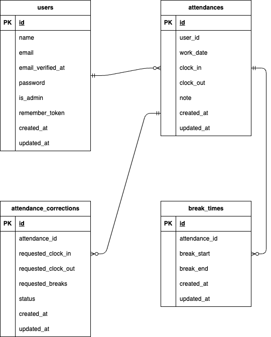

# 勤怠管理アプリ 『KintaiApp』

本リポジトリは Laravel ベースのシンプルな勤怠管理アプリです。
主な目的は「打刻（出勤/休憩/退勤）」「勤怠一覧」「勤怠の修正申請・承認（ユーザー ⇄ 管理者）」の実装と、それに伴うバリデーション／テストの整備です。

---

## 環境構築

### 開発環境立ち上げ

#### 1.リポジトリをクローン

- git clone git@github.com:KenKen416/KintaiApp.git

#### 2.ディレクトリ移動

- cd KintaiApp

#### 3.コマンド実行

- make init

### テスト環境

#### 1.テスト用データベースの作成

- docker-compose exec mysql bash
- mysql -u root -p
  （補足）パスワードは root と入力
- create database demo_test;

#### 2.テスト実行

- docker compose exec php php artisan test

---

## ログイン情報

### 管理者アカウント

- email: admin@admin
- password: password

### 一般ユーザー

#### ユーザー１
- email: test1@test
- password: password
#### ユーザー２
- email: test2@test
- password: password
#### ユーザー３
- email: test3@test
- password: password
#### ユーザー４
- email: test4@test
- password: password
#### ユーザー５
- email: test5@test
- password: password

---

## 使用技術

- laravel 8.6.12
- php 8.2
- nginx:1.21.1
- mysql:8.0.29
- mailhog

---

## ER 図

---

## URL

- 開発環境：http://localhost/
- phpMyAdmin:http://localhost:8080
- MailHog UI:http://localhost:8025

## そのほかの仕様・テーブル情報など

https://docs.google.com/spreadsheets/d/1WB1N4ZaWeAfJIsa0ODOfAHezSz0QLbAKunI3FkNwKrc/edit?gid=1113232830#gid=1113232830

---

## 採点者の方へ

下記の通り、担当コーチと会話をして、仕様を修正もしくは、仕様書には書かれていなかった部分の仕様決めを行いました。

- 勤怠一覧画面：勤務実績がない日は詳細ボタンを配置しない
- バリデーション文言：機能要件とテストケース一覧に置いて、バリデーション文言が異なるものがあったが、機能要件シートを正としてテストは実施。（勤務や休憩の時間の前後関係のあたりの文言です。）
- 勤務実績修正画面におけるフォーム：UI 改善を目的に、入力方法をテキストではなく、time 選択方式に変更しました。それに伴い UI が figma のものとはずれています。
- 勤務実績修正：管理者による修正はその場で即座に反映される仕様とする（管理者は自身でさらに承認する必要はないので）。また、一般ユーザーから修正申請が出ているタイミングにおいても、管理者は勤務実績の修正が可能（管理者の権限の方が強いのが一般的）。
- スタッフ一覧：一般ユーザーのみを一覧表示（管理者は表示されない）
